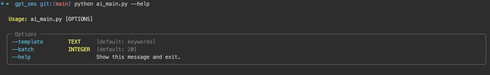

# GPT Message Parser

## Recommend: Run On Colab
[Colab Notebook](messagegpt.ipynb)

## Iterative Prompt Design
[Colab Notebook](prompt_iteration.ipynb)


## Configurations

Recommend to use a absolute path on google drive, e.g.     
`sqlite:////content/drive/MyDrive/Not Code/testsl.db`


```bash
export OPENAI_API_KEY=your_api_key
export SQLITE_URI="sqlite:////content/drive/MyDrive/Not Code/testsl.db"
```

## Prepare your data in either csv or feather format
Locate your file at `/path/to/csv/file` or `/path/to/feather/file`,  which will be used in data preparation step.

## Create message database
```bash
python data_main.py --fmt [csv|feather] [--replace] path/to/csv/file 
```


## Run GPT message parser
```bash
python ai_main.py --template keywords --batch 20
```
