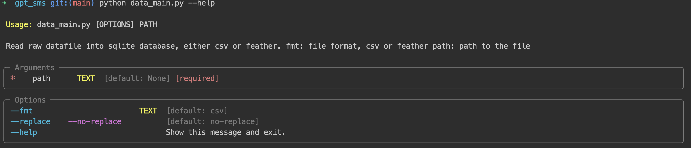

# GPT Message Parser

## Configurations
mib_messages/config.py
```python
class Settings(BaseSettings):
    DB_URI:str = "sqlite:///message_ai.db" # replace with a persistent db file location
    OPENAI_API_KEY:str = os.getenv("OPENAI_API_KEY","fake_api_key") # export OPENAI_API_KEY=your_api_key
    FEWSHOT_EXAMPLE_PATH = "./example.json" # if you have a fewshot example json file
```
Recommend to use a absolute path on google drive, e.g.
`sqlite:////content/drive/MyDrive/Not Code/testsl.db`

## Prepare your data either csv or feather
Locate your file at `/path/to/csv/file` or `/path/to/feather/file`,  which fill be used in data preparation step.

## Prepare Data
```bash
python data_main.py --fmt [csv|feather] [--replace] path/to/csv/file 
```


## Run GPT message parser
```bash
python ai_main.py --template keywords --batch 20
```
