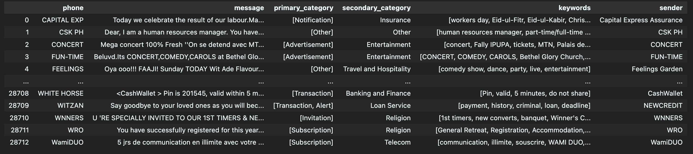

# 创建短信类别维表

### 你需要有一个feather文件，里面存储一些干净的短信解析数据



### 运行vectorize.py， 生成一个sqlite的数据库。
只需要修改这俩地方
```python
INPUT_FILE = "normalized.feather"
OUTPUT_DB = "ng_message_ai.db"
```

然后
```bash
python vectorize.py
```